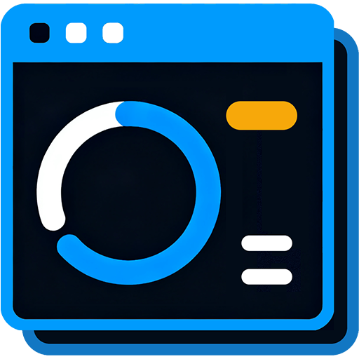

<p align="center">
  <a href="https://atticus-lv.github.io/BlenderSuite.RenderQueue/">
    
  </a>
</p>

<h1 align="center">Blender Suite: Render Queue</h1>

<p align="center">
  A native desktop render queue for Blender workflows, focused on queued rendering, visible progress, and output handling.
</p>

<p align="center">
  <a href="https://atticus-lv.github.io/BlenderSuite.RenderQueue/">Website</a>
  ·
  <a href="https://github.com/atticus-lv/BlenderSuite.RenderQueue/releases">Download</a>
  ·
  <a href="docs/README.md">Development</a>
  ·
  <a href="docs/README.zh-CN.md">Chinese Docs</a>
</p>

<p align="center">
  <a href="https://github.com/atticus-lv/BlenderSuite.RenderQueue/blob/main/LICENSE">
    
  </a>
  
  
</p>

## Overview

Blender Suite: Render Queue collects multiple Blender render jobs into one native desktop workspace. It can queue `.blend` files, override scenes and frame ranges, show progress and logs, and help finish output work such as sequence preview and video composition.

## Highlights

- Queue multiple `.blend` files, scenes, and frame ranges.
- Submit render jobs from Blender through the companion extension.
- Pause, resume, stop, enable, or disable render tasks.
- Track task state, current frame, logs, and hardware usage.
- Preview image sequences and compose video output.
- Native desktop app built with .NET 10 and Avalonia 12.
- Chinese / English UI with light and dark themes.

## Development

### Requirements

- [.NET 10 SDK](https://dotnet.microsoft.com/download/dotnet/10.0)
- [Inno Setup 6](https://jrsoftware.org/isdl.php) for Windows installer packaging
- `hdiutil`, `sips`, and `iconutil` for macOS `.dmg` packaging

### Build And Test

```bash
git clone <repository-url>
cd BlenderSuite.RenderQueue
dotnet build BlenderSuite.RenderQueue.sln
dotnet test BlenderSuite.RenderQueue.sln
```

## Development Docs

- [Development](docs/README.md)
- [Chinese Development Docs](docs/README.zh-CN.md)

## License

This project uses a dual-license model:

- The public version is licensed under [GNU Affero General Public License v3.0 only](LICENSE) (`AGPL-3.0-only`).
- Closed-source distribution, proprietary integration, OEM usage, SaaS/hosted services, or other usage incompatible with AGPLv3 requires a separate commercial license. See [COMMERCIAL_LICENSE.md](COMMERCIAL_LICENSE.md).
- Contributions require agreement to [CONTRIBUTOR_LICENSE_AGREEMENT.md](CONTRIBUTOR_LICENSE_AGREEMENT.md).
